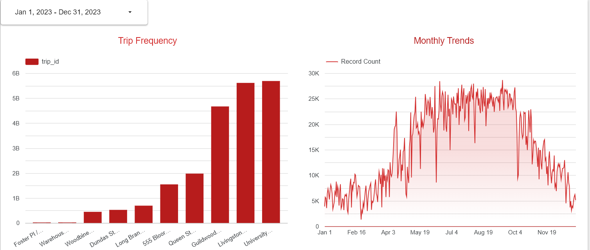

# Toronto Bikeshare Ridership Data Engineering

# Project Overview:

This repository contains a comprehensive data engineering project developed as part of the Data Engineering Zoomcamp. The project focuses on processing bikeshare data from Toronto Open Data, specifically the bikeshare-ridership dataset. This dataset provides detailed records of bike trips, including trip duration, station details, and user types.

Dataset Fields:

- Trip Id – Unique identifier for each trip
- Trip Duration – Total duration of the trip
- Start Station Id – Identifier for the starting station
- Start Time – Timestamp when the trip began
- Start Station Name – Name of the starting station
- End Station Id – Identifier for the destination station
- End Time – Timestamp when the trip ended
- End Station Name – Name of the destination station
- Bike Id – Unique identifier for the bike used
- User Type – Classification of the user (e.g., annual, casual)

By implementing batch processing pipelines, this project ensures efficient data ingestion and transformation on a scheduled basis, enabling data analysts to derive meaningful insights from Toronto's bikeshare ridership trends.

## Problem Statement:

How do temporal patterns and station-level dynamics affect bikeshare usage in Toronto's Bikeshare program? Additionally, what insights can be derived about user behavior and system efficiency by analyzing trip durations, station popularity, and user type distributions across different time periods?

## Expected Benefits:

- Automated Data Ingestion: Kestra get data directly from Toronto Bikeshare using API.
- Cloud Storage: Extracted data stored in Google Cloud Storage(GCS).
- Transform Data: simple transformation using BigQuery.
- Dashboard: data visualized in cloud using Looker Studio.

## Architecture

## Technologies

- Kestra - Data Orchestration
- Google Cloud Platform (GCP) - Storage & BigQuery
- Docker - Containerization
- Looker Studio - Dashboard & Visualization

## Dashboard

## Reproducibility

### Prerequisites

To be able to run this project, make sure you have installed:

- Docker

Already have active Google Cloud Account with the following APIs enabled:

- Cloud Storage API
- BigQuery API
- IAM API

A service account with the following roles:

- roles/storage.admin
- roles/bigquery.admin

Generate a key file of your service account, as it will be used in Kestra.

### Quickstart

### 1. Clone the repository:

```bash
git clone https://github.com/Yusufislam-id/Toronto-Bikeshare-Pipeline.git
cd Toronto-Bikeshare-Pipeline
```

### 2. Start Kestra with Docker

```bash
cd kestra_orchestrator
cd flows
```

Open http://localhost:8080 on your browser to access Kestra

### 3. Create and Run Kestra flows

```bash
curl -X POST http://localhost:8080/api/v1/flows/import -F fileUpload=@flows/00_gcp_kv.yaml
curl -X POST http://localhost:8080/api/v1/flows/import -F fileUpload=@flows/01_gcp_setup.yaml
curl -X POST http://localhost:8080/api/v1/flows/import -F fileUpload=@flows/02_gcp_bikeshare.yaml
```

1. run command above to import all flows into Kestra.
2. copy your key to 00_gcp_kv.yaml on task id: gcp_creds.
3. execute 00_gcp_kv.yaml to set up your key_value, proj_id, loc, bucket, dataset.
4. execute 01_gcp_setup.yaml to create storage & dataset.
5. execute 02_gcp_bikeshare.yaml to run the pipeline.

### 4. Simple Transformation

1. run sql query from sql folder.
2. 01_create_external_table_from_gcs, to create external table.
3. 02_parse_and_clean_data, to parse and clean data.
4. 03_create_partitioned_and_clustered, to create partitioned table by start_time and clustered by user_type, start_station_id

### 5. Build Dashboard with Looker Studio

1. Go to Looker Studio.
2. Create a new report and connect your BigQuery table (bikeshare_2023).
3. Build interactive visualizations for:
   - Trip frequency
   - Monthly trends


url: https://lookerstudio.google.com/reporting/a77d6cd9-10d0-41c4-a8ac-dfd615370059
